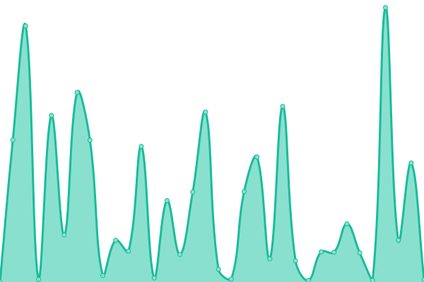

# [📈 Live Status](https://kingbain.github.io/proto-datahub-uptime): <!--live status--> **🟧 Partial outage**

This repository contains the open-source uptime monitor and status page for [John Bain](kingbain.com), powered by [Upptime](https://github.com/upptime/upptime).

With [Upptime](https://upptime.js.org), you can get your own unlimited and free uptime monitor and status page, powered entirely by a GitHub repository. We use [Issues](https://github.com/kingbain/proto-datahub-uptime/issues) as incident reports, [Actions](https://github.com/kingbain/proto-datahub-uptime/actions) as uptime monitors, and [Pages](https://kingbain.github.io/proto-datahub-uptime) for the status page.

<!--start: status pages-->
<!-- This summary is generated by Upptime (https://github.com/upptime/upptime) -->
<!-- Do not edit this manually, your changes will be overwritten -->
<!-- prettier-ignore -->
| URL | Status | History | Response Time | Uptime |
| --- | ------ | ------- | ------------- | ------ |
|  [FSDH POC(Vanity) EN](https://federal-science-datahub.canada.ca/register) | 🟩 Up | [fsdh-poc-vanity-en.yml](https://github.com/KingBain/proto-datahub-uptime/commits/HEAD/history/fsdh-poc-vanity-en.yml) | 

 750ms
     
 | 

<a href="https://kingbain.github.io/proto-datahub-uptime/history/fsdh-poc-vanity-en">100.00%</a>
    

|  [FSDH POC(Vanity) FR](https://datahub-scientifique-federal.canada.ca/register) | 🟩 Up | [fsdh-poc-vanity-fr.yml](https://github.com/KingBain/proto-datahub-uptime/commits/HEAD/history/fsdh-poc-vanity-fr.yml) | 

 313ms
     
 | 

<a href="https://kingbain.github.io/proto-datahub-uptime/history/fsdh-poc-vanity-fr">100.00%</a>
    

|  [FSDH DEV](https://fsdh-portal-app-dev.azurewebsites.net/register) | 🟩 Up | [fsdh-dev.yml](https://github.com/KingBain/proto-datahub-uptime/commits/HEAD/history/fsdh-dev.yml) | 

 3305ms
     
 | 

<a href="https://kingbain.github.io/proto-datahub-uptime/history/fsdh-dev">99.14%</a>
    

|  [FSDH INT](https://fsdh-portal-app-int.azurewebsites.net/register) | 🟥 Down | [fsdh-int.yml](https://github.com/KingBain/proto-datahub-uptime/commits/HEAD/history/fsdh-int.yml) | 

 8034ms
     
 | 

<a href="https://kingbain.github.io/proto-datahub-uptime/history/fsdh-int">78.41%</a>
    

|  [FSDH POC](https://fsdh-portal-app-poc.azurewebsites.net/register) | 🟩 Up | [fsdh-poc.yml](https://github.com/KingBain/proto-datahub-uptime/commits/HEAD/history/fsdh-poc.yml) | 

 214ms
     
 | 

<a href="https://kingbain.github.io/proto-datahub-uptime/history/fsdh-poc">100.00%</a>
    

<!--end: status pages-->

[**Visit our status website →**](https://kingbain.github.io/proto-datahub-uptime)

## 📄 License

- Powered by: [Upptime](https://github.com/upptime/upptime)
- Code: [MIT](./LICENSE) © [Anand Chowdhary](https://anandchowdhary.com), supported by [Pabio](https://pabio.com)
- Data in the `./history` directory: [Open Database License](https://opendatacommons.org/licenses/odbl/1-0/)
